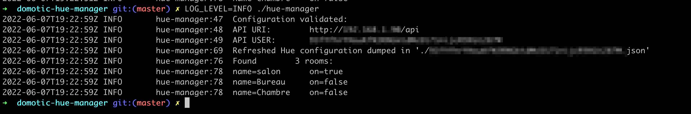

# philips-hue-manager

## What will I find in this repo?
A CLI to interact with the [Philips Hue API](https://developers.meethue.com/develop/get-started-2/).
This is just a pretext to play with different tools like ~~zsh script, jq~~, Go, REST APIs etc...


## ~~What will I need to run it?~~
  - [jq](https://stedolan.github.io/jq/)
  - [curl](https://curl.se/)
  - [zsh](https://ohmyz.sh/)

## ~~How can I run it?~~

```shell
git clone git@github.com:FXHibon/domotic-hue-manager.git
cd ./domotic-hue-manager

# you'll need value correctly the 2 required fields in this json
cp .credentials.json.dist .credentials.json

chmod u+x ./hue-manager

./hue-manager
```
If everything goes well, you should see something like:


## What next?

Well, there is a lot of things to be done obviously:
- [ ] Implement a simpler logger without `$LINENO` explicitly passed in every function as parameter 😅
- [ ] Implement basic interactions with the rooms, like switch on / off a room, because this tool is useless without this obviously
- [ ] Add [Alfred Wokflow](https://www.alfredapp.com/workflows/) support
  - Yes I know that there is already a workflow for this, but it depends on python2 and I really don't want to downgrade my python installation from version 3 to 2, which is the current recommanded solution (https://www.alfredapp.com/help/kb/python-2-monterey/)
- [ ] Refactorize the code in small functions
- [ ] Add tests
- [ ] migrate to [golang](https://go.dev/) => work in progress

## Resources
- [https://github.com/benknight/hue-alfred-workflow](https://github.com/benknight/hue-alfred-workflow)
- [https://developers.meethue.com/develop/get-started-2/](https://developers.meethue.com/develop/get-started-2/)
